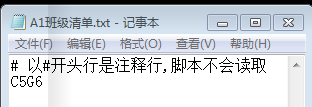
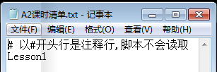
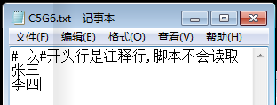

# HowtoManageStudentsHomeWork

## 适用于什么情境？
作为一名信息技术老师，您可能会身处这样的困境中：

- 班级多

担任很多个班级的信息技术课程
- 学生多

每个班级学生人数众多
- 任务重

忙于很多事务，时间很有限

**如何快速统计每个班每节课哪些同学提交了作业，哪些同学没有？**
## 优势
针对以上情况，这个项目提供了一种解决方案。

不用安装任何软件，不需任何特殊的编程语言——所需的就是MS-DOS

每次统计学生交作业情况时，只需双击鼠标或者运行一个命令，就这么简单。
## 项目结构
项目结构是约定好的，不要搞创新。:smile:

学生名单、班级名单、学生作业统计目录等都放要在默认位置，

文件夹名或文件名不要改动，命令及其参数也要遵守约定。
```
.
├── A1班级清单.txt			# 用于存放班级名称,如“六（5）班”
├── A2课时清单.txt			# 用于存放课时名称，如“第1课”
├── A3各班级学生清单			# 每个班的学生名单以班级为单位放在此文件夹中
├── A4各班级作业统计			# 每个班以课时为单位自动生成的文件存放此中
├── CreatDir.bat			# 运行此批处理文件，创建工作目录
├── ListStatus.bat			# 运行命令，统计学生提交作业情况
└── README.md				# 项目指导说明书

```
## 快速指导
此项目是基于Windows操作系统，简单易用，0门槛。 

下载本项目后，下面的两个批处理文件是必须存在的，其它的文件可以删除：
```
.
├── CreatDir.bat
├── ListStatus.bat

```
### 初次建立工作目录
双击运行`CreatDir.bat`，你会在当前目录下得到如下文件目录结构：
```
.
├── A1班级清单.txt			# 文本文件，被自动创建
├── A2课时清单.txt			# 文本文件，被自动创建
├── A3各班级学生清单			# 文件夹，被自动创建
├── A4各班级作业统计			# 文件夹，被自动创建
├── CreatDir.bat
├── ListStatus.bat
```

### 班级名单作成
手动将各班级名单逐行追加到`A1班级清单.txt`文件中，并保存。

:heavy_exclamation_mark:温馨提示
此文件中的班级名如`C5G6`将作为文件`ListStatus.bat`的第2个参数

### 课时清单作成
打开`A2课时清单.txt`文件，按行输入所需课时。

如`Lesson1`,`Lesson2`,`Lesson3`...

:heavy_exclamation_mark:温馨提示
- 此文件中的每行如`Lessson1`将作为文件`ListStatus.bat`的第1个参数
- `ListStatus.bat` 运行时，是依据学生姓名进行查找的，所以学生提交的作业文件的文件名必须包含该学生的姓名

### 再次更新工作目录
只要`A1班级清单.txt`或`A2课时清单.txt`其中任何一个文件有变动，都要双击运行`CreatDir.bat`文件,以及时更新工作目录。

每次运行`CreatDir.bat`更新目录结构，不会影响已有的目录或文件，请放心大胆的操作。
### 学生名单作成
将每个班的学生名单逐行添加到相应班级的文件中，并保存。

如文件A3各班级学生清单\C5G6.txt用于存放六（5）班所有学生的名字。

一行一个学生，对于同名学生，建议在名字前加上“大”或“小”以示区分。

如同一个班有两个学生都叫“王鑫”，可以用“大王鑫”和“小王鑫”加以区分。

```
张三
李四
大王鑫
小王鑫
John
欧阳汝阳
...
```
### 生成统计名单
生成统计名单，可以通过两个途径：
- 途径一：命令行方式
- 途径二: 双击鼠标(推荐）

假设前提：

- `A1班级清单.txt`文件中包含下面一行内容：
```
C5G6
```
- `A2课时清单.txt`文件中包含下面一行内容：
```
Lesson1
```
- `A3各班级学生清单\C5G6.txt`文件最好要有学生姓名,如
```
张三
李四
...
```






运行CreatDir.bat更新目录后，对应的工作目录结构：
```
.
├── A1班级清单.txt
├── A2课时清单.txt
├── A3各班级学生清单
│   └── C5G6.txt			# 六（5）班学生名单
├── A4各班级作业统计
├── C5G6
│   └── Lesson1				# 文件夹，用于存放第1课学生作业
│       └── Listme.bat			# 由CreatDir.bat文件创建，用于统计本课时学生交作业的情况
├── CreatDir.bat
├── ListStatus.bat
```
#### 途径一
打开cmd窗口，进入`ListStatus.bat`所在的目录。
如果`ListStatus.bat`文件在E盘，可以输入如下命令：
```
cd E: /d
```
在窗口中运行`ListStatus %1 %2`命令，参数%1即指课时，要与文件`A2课时清单.txt`里的课时名称保持一致。如`Lesson1`

参数%2即指班级，要与`A1班级清单.txt`文件中每行的班级名保持一致（如C5G6）。
现在，如果你要生成六（5）班第1课学生提交作业情况的文件，可以输入如下命令：
```
ListStatus Lesson1 C5G6
```
按`Enter`确定输入，很快你会得到一个`Lesson1_C5G6_统计.txt`文件。进入`A4各班级作业统计`打开`Lesson1_C5G6_统计.txt`文件看看吧。以下是该文件的示例内容：
```
班    级	C5G6
共    计	2人
课    时	Lesson1
作成时间	2018-04-16

序号	状态	班级	姓名
1	未交	C5G6	张三

1	已交	C5G6	李四
```
#### 途径二
直接双击Lesson1目录下的`Listme.bat`文件，你也会得到位于`A4各班级作业统计`目录下的`Lesson1_C5G6_统计.txt`文件。
